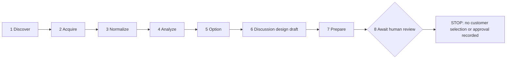

# MOSAIC

**Multi-customer Orchestration System for Adaptive Intake and Continuous Delivery**

**AI-first business process automation for solution engineering.**

**Scale the expertise. Keep the accountability.** Start with the [three-slide PDF](presentation/mosaic-challenge-deck.pdf), [browser deck](presentation/mosaic-challenge-deck.html), or [2:55 workflow video](https://youtu.be/RP4CeCYt4VE). The [submission finish line](submission/OPEN-ITEMS.md) separates completed repository work from entrant-owned submission actions.

## What MOSAIC Is

MOSAIC is an **AI-first business process automation and orchestration system for the solution-engineering lifecycle**. A business user describes a problem, requirement or opportunity in plain language. In **GitHub Copilot App**, MOSAIC asks only relevant follow-up questions, acquires approved evidence, structures the problem, compares exactly three solution approaches, prepares a proposed design and delivery-readiness plans, validates the package, and hands an auditable solution dossier to qualified people for decisions.

MOSAIC automates the repeatable process around expert judgment; it is not merely a chatbot or document generator. The documents are the durable record of an eight-stage process: **Discover -> Acquire -> Normalize -> Analyze -> Option -> Design -> Prepare -> Review**. The current reference produces **23 governed artifacts**: ten browser pages, nine Markdown reports and four structured JSON records covering the business context, scope, requirements, assumptions, unknowns, risks, options, proposed architecture, implementation, verification, interfaces, security, deployment and rollback, operations and adoption, measurement, evidence, validation, transcript, audit trail and customer meeting materials.

The problem is process fragmentation. Teams repeatedly clarify incomplete requests, search scattered guidance, recreate analysis, and rebuild context for every specialist and customer handoff. That increases effort and cost, extends cycle time, creates inconsistent reporting, loses institutional knowledge, and makes decisions harder to review. MOSAIC replaces that fragmented preparation with one reusable, evidence-grounded, policy-controlled workflow while keeping consequential authority with people. Humans still resolve unknowns, select the architecture, approve the exact dossier revision, authorize implementation, and control release.

MOSAIC is designed for adoption by **small businesses, midsize organizations and large enterprises**. The core process stays consistent while each organization supplies its own isolated evidence, terminology, templates, policies, roles, systems and approval rules. Smaller teams gain a guided process they may not have the capacity to build themselves; larger enterprises gain repeatability, governance, traceability and cross-team consistency. The current repository proves a synthetic reference pattern, not universal fit or completed customer adoption.

The reporting layer is designed to be **highly customer-customizable**. Each organization can define its branding, terminology, required document profile, section wording, reviewer roles, evidence policy, control mappings and approval language without weakening the non-removable evidence, unknown, risk, decision and human-authority controls. The contest reference demonstrates a shared rendering system, customer-configured reviewer roles, document compatibility checks and maintainable templates. Arbitrary customer-selected templates and zero-code terminology mapping remain product-extension work, not already-proven runtime capability.

## Business Value

MOSAIC is designed to improve four measurable outcomes:

- **Cost and capacity:** reduce duplicated specialist preparation and avoidable rework.
- **Effort:** reuse approved questions, evidence policies, analysis patterns, controls and dossier structures across isolated customer engagements.
- **Reporting quality:** produce a consistent, traceable solution dossier instead of disconnected notes, chat summaries and slide fragments.
- **Lifecycle efficiency:** preserve requirements, evidence, alternatives, decisions and readiness plans from intake through review so downstream teams do not reconstruct the project at every handoff.
- **Process simplicity:** give requesters and reviewers one understandable path, one structured dossier and explicit decision gates instead of disconnected tools and handoffs.

The **base planning case returns 80 specialist hours per eligible request, about 83% less effort, worth $16,000 in gross capacity at an assumed $200/hour**. It models 96 hours of manual intake/design reduced to 16 hours of retained human validation. At an illustrative 100 eligible requests annually, that is **8,000 hours and $1.6 million of gross capacity value**, before platform, integration, governance and operating costs.

These are estimates, not measured MOSAIC or Copilot outcomes, cash savings, customer-volume forecasts or staffing commitments. Extra review, coordination and correction effort reduces the modeled benefit. The [planning economics](docs/evaluation-plan.md#planning-economics) give the inputs, review-time sensitivity, scale examples and cost thresholds. The broader opportunity is reusable Microsoft engineering capacity across customers and field roles, not a solution limited to the source test case.

> **Reference implementation:** This repository is a fully synthetic, offline-capable contest demonstration of the solution-preparation portion of MOSAIC. It proves workflow structure, evidence traceability, deterministic checks, reusable GitHub Copilot App customizations, and a non-delegable human gate. It prepares implementation and delivery-readiness documentation but does not execute the proposed solution, deploy anything, record customer approval, or implement the example employee assistant.

**Evidence status:** Authentic Copilot App skill and Local MCP use is archived. Local checks cover the prewritten reference and scripted synthetic intakes, including bounded live model analysis, synchronous report generation, exact transcript preservation, responsive reports and integrity-checked no-repeat recovery. These simulations are not customer acceptance. The published workflow video shows the native App intake and browser handoff, and the deck uses authentic crops from that recording. Hosted issue, worktree, PR, CI, and reviewer-correction scenes remain unclaimed. See the [delivery backlog](submission/OPEN-ITEMS.md) for current acceptance status and the [competition audit](submission/competition-audit.md) for dated research and verification.

## Microsoft Value

| Value opportunity                       | How the pattern supports it                                                                                           | Evidence still needed                                                                                                     |
| --------------------------------------- | --------------------------------------------------------------------------------------------------------------------- | ------------------------------------------------------------------------------------------------------------------------- |
| Scale scarce engineering expertise      | Reuse approved knowledge, specialist roles, stage contracts, and reviewable packages across engagements               | Independent scenarios, practitioner adoption, and throughput measurements                                                 |
| Return specialist capacity              | Planning case: 80 hours and $16,000 gross capacity per eligible request; $1.6M at 100 illustrative annual requests    | Matched-case preparation, retained review, corrections, productive redeployment, eligible volume and full operating costs |
| Shorten the delivery lifecycle          | Carry requirements, decisions, and acceptance intent into proposed downstream artifacts                               | An authorized end-to-end pilot with measured lead time and defect escape                                                  |
| Raise quality and consistency           | Require visible evidence, alternatives, tradeoffs, unknowns, and accountable review instead of an unstructured answer | Blind expert assessment of correctness, completeness, usability, and corrections                                          |
| Expand the value of Microsoft platforms | Make Copilot-assisted, GitHub-centered customer engineering reusable and governable                                   | Actual hosted workflow proof and customer/partner adoption evidence                                                       |

The unit of work is a **solution initiative**: a new or materially changed application, AI agent, API, integration, workflow automation or data product, not a support ticket. The employee-policy assistant is one synthetic example, not the product's market boundary. Multi-customer means independently isolated customer installations with immutable customer identity; it does not mean mixing customer content in a shared runtime.

Proposed implementation, verification, API, security, deployment, rollback, operations and adoption documentation belong to the design scope. The report package maps all ten dossier areas and supplies seven evidence-linked planning sections across ten HTML pages, nine Markdown reports and four JSON records, including the intake transcript. These are discussion drafts, not a complete selected dossier or executable delivery. **Continuous Delivery names the product direction; it does not authorize implementation or deployment.** The [adoption roadmap](docs/adoption-playbook.md#governed-sdlc-extension) distinguishes preparing delivery plans from executing separately authorized downstream work.

Customer-approved SOC 2 control objectives, applicable NIST frameworks, and ITIL 4 practices can inform those policies and review contracts. They are not a blanket compliance claim. See the [standards mapping](docs/governance-and-rai.md#standards-mapping). MOSAIC complements Microsoft's existing capabilities; portfolio-wide superiority and better-than-human performance have not been established.

## The Enterprise Problem

Solution architects often receive incomplete requests and must reconstruct outcomes, locate approved guidance, separate facts from assumptions, identify risks, compare approaches, and prepare customer discovery materials. The work is valuable but difficult to scale when evidence, analysis, and decisions are spread across tools and documents.

The intended App workflow changes the unit of work from an unstructured conversation to a reviewable GitHub package:

- one fictional business request starts in the conversation; an authorized workflow reference may also supply context
- one isolated Copilot App session follows a versioned skill and repository instructions
- one read-only MCP server exposes only allowlisted evidence
- seven automatable stages produce structured JSON and reviewable documents
- deterministic checks validate schemas, citations, options, and authority boundaries
- one pull request holds the diff, checks and corrections; customer selection and exact-revision design approval remain in the configured customer workflow

The primary users are account teams, customer success, solution sales, developers and solution architects, working with customer product owners and policy/security specialists. The [field reuse map](docs/adoption-playbook.md#who-reuses-what) identifies the existing outputs each role can use and the decisions it retains.

## What Judges Can Prove

Run one command and inspect the generated package:

```powershell
./scripts/run_demo.ps1
```

The command creates 23 artifacts under `demo-output/SYN-001/`, returns validation status `pass`, and stops at `awaiting_human_review`. The canonical generated example is maintained under [examples/synthetic/expected/](examples/synthetic/expected/). The overview links to nine report pages with shared navigation, themes, visual comparisons and keyboard/touch explanations. Markdown and JSON remain available without a browser or server.

| Proof                                                             | Where to inspect                                    |
| ----------------------------------------------------------------- | --------------------------------------------------- |
| Eight ordered stages                                              | `package.json` and `audit-ledger.json`              |
| Approved-source boundary                                          | `evidence-appendix.md` and the MCP tools            |
| Claim labels and citations                                        | `evidence-appendix.md` and `validation-report.json` |
| Exactly three options                                             | `option-matrix.md`                                  |
| Ten dossier areas and seven traceable draft plans                 | `architecture-brief.md`                             |
| Customer engagement package                                       | meeting request, agenda, and 30-minute talk track   |
| Two pending customer decisions and policy-required reviewer roles | `human-review.md` and pull-request template         |
| Readable decision view                                            | `index.html`                                        |

## Eight-Stage Workflow



This executable reference stops before either customer decision. In the governing product workflow, authorized architecture selection precedes synthesis of the selected dossier; subsequent design-package approval cites its exact immutable repository revision. A PR supports review but is not customer approval unless customer policy explicitly maps that authority. The preselection draft here must not be treated as the final selected design. No live decision ingestion, durable wait/resume engine or automatic approval is implemented.

| Stage     | Agent contribution                               | Required evidence or output                                                                |
| --------- | ------------------------------------------------ | ------------------------------------------------------------------------------------------ |
| Discover  | Qualify the business problem and desired outcome | Structured intake and eligibility                                                          |
| Acquire   | Retrieve only approved sources                   | Revisioned, classified, hashed evidence manifest                                           |
| Normalize | Preserve terminology and structure requirements  | Requirements, constraints, labeled claims                                                  |
| Analyze   | Surface what is missing or unsafe                | Gaps, risks, dependencies, assumptions, unknowns, questions                                |
| Option    | Compare viable patterns consistently             | Exactly three options, tradeoffs, conditions, disqualifiers                                |
| Design    | Prepare an unselected discussion draft           | Ten-area coverage map, seven evidence-linked plans, trust boundaries and missing decisions |
| Prepare   | Build the decision workshop                      | Report, evidence appendix, agenda, questions, talk track                                   |
| Review    | Preserve two separate customer decisions         | Selection pending; exact-revision design approval blocked pending selection                |

## GitHub Copilot App Pattern

MOSAIC uses GitHub Copilot App as the orchestration and review workspace, not as an autonomous approver.

1. **Business context:** Describe the actual fictional problem in ordinary language. The agent asks relevant questions about scope, impact, budget, timing and risk; the requester does not prepare a sample file or tool script.
2. **Intake control:** Answer one descriptive question at a time or choose **End intake and generate report** from that question's options. Every interview turn is conversation-only: no transcript writes, configuration reads, evidence acquisition or model-analysis jobs between answers. Corrections remain in the conversation, and unanswered details stay unknown. Use an already-callable native question selector or numbered options and free text.
3. **Plan mode:** Before generation, review the proposed evidence, tools, output boundary and stop conditions. Use an isolated session/workspace so concurrent initiatives do not mix inputs.
4. **Optional specialist review:** The repository's custom agents support separately requested, bounded evidence, intake, architecture and engagement work. Delegation is not interleaved with interview questions or required by the standard single-call generation path.
5. **Connected context:** Enable the local `mosaic-synthetic-evidence` MCP server. Its two tools are read-only and limited to four synthetic files.
6. **Validated generation:** After the disclosed plan is approved, the configured engine makes one bounded, separately authenticated Copilot CLI analysis call, then assembles and validates 23 files synchronously. The conversation returns the completed report and an **Open documents in browser** action. Notifications are disabled, the transcript stays local and outside the model prompt, and paid inference is never retried automatically. This is not native App delegation or PC-off execution.
7. **Human review:** Open the exact completed report revision. If separately authorized, prepare a pull request carrying the proposed diff, checks and reviewer discussion. Local conversational files remain excluded from publication.
8. **Customer decisions:** Authorized customer roles record architecture selection and, later, exact-revision dossier approval in the customer workflow. The reference records neither. Passing checks and PR review never imply customer authorization.

GitHub documents these first-party issue, branch, pull-request, and review surfaces. This is the intended walkthrough, not a claim that every step has been recorded. The CLI does not create issues, branches, pull requests, or reviewer decisions. Agent Merge is intentionally excluded from MOSAIC's default flow.

## Roles And Decision Rights

| Role                       | May do                                                                           | Must not delegate                                                    |
| -------------------------- | -------------------------------------------------------------------------------- | -------------------------------------------------------------------- |
| Requester or product owner | Supply problem, outcomes, measures, constraints, and corrections                 | Business ownership and acceptance criteria                           |
| Evidence curator agent     | Inspect allowlists, provenance, classification, revisions, hashes, and citations | Source authorization and access approval                             |
| Intake analyst agent       | Normalize requirements and draft gap, risk, and question registers               | Customer facts or risk acceptance                                    |
| Solution architect agent   | Draft three options, tradeoffs, trust boundaries, and recommendation             | Architecture selection and product-fit approval                      |
| Engagement planner agent   | Draft meeting package and decision prompts                                       | Customer commitments and communication approval                      |
| Qualified human reviewers  | Correct, request evidence, reject, or approve the exact revision                 | Policy, security, architecture, customer, and release accountability |

## Prerequisites

### Offline Synthetic Demo

- Git
- Python 3.12 or later
- Windows PowerShell, or a POSIX-compatible shell

### GitHub Copilot App Walkthrough

- GitHub Copilot App on Windows, macOS, or Linux
- a GitHub account with an eligible Copilot plan
- GitHub Copilot CLI policy enabled by an administrator when required
- access to the final repository and enough premium requests for the walkthrough
- `mcp>=2,<3` installed when using the synthetic MCP server

Current app behavior and setup should be rechecked against [GitHub Copilot App documentation](https://docs.github.com/en/copilot/how-tos/github-copilot-app) before recording or submitting.

## Five-Minute Quick Start

### Windows

```powershell
git clone https://github.com/gregunger/ghca-mosaic-challenge-official.git mosaic-governed-enterprise-intake
Set-Location mosaic-governed-enterprise-intake
py -3.12 -m venv .venv
.\.venv\Scripts\Activate.ps1
python -m pip install -e ".[dev,mcp]"
python -m pip install -e ".[windows]"
./scripts/run_demo.ps1
python -m pytest
```

### macOS Or Linux

```bash
git clone https://github.com/gregunger/ghca-mosaic-challenge-official.git mosaic-governed-enterprise-intake
cd mosaic-governed-enterprise-intake
python3 -m venv .venv
source .venv/bin/activate
python -m pip install -e '.[dev,mcp]'
./scripts/run_demo.sh
python -m pytest
```

Cloning requires access to the repository at its owner-selected visibility. Judge access to the exact repository revision and linked media must be confirmed separately; this guide does not establish current access or publication approval.

Expected CLI result:

```json
{
  "status": "pass",
  "initiativeId": "SYN-001",
  "state": "awaiting_human_review",
  "validation": "pass",
  "artifactCount": 23
}
```

Open `demo-output/SYN-001/index.html` to inspect the visual package. Unchanged request and generated package produce the same run ID; changed evidence revisions or bytes change that identity. A Git commit separately identifies the code, policy, and document revision. A run ID is not a signature or approval record. Git attributes preserve the exact synthetic source bytes across platforms.

### Local Intake Reports

For an explicitly requested offline reference-job smoke test:

```powershell
python -m mosaic.jobs generate --reference --request examples/synthetic/request.json
```

For conversational work, questions and answers stay in the current conversation without per-answer file or command work. After the bounded generation plan is approved, the agent saves available exact history with one atomic `mosaic.jobs capture --batch ... --quiet` call, prepares the brief under ignored `build/intake/<SYN-initiative-id>/`, and calls `mosaic.jobs generate` with `--transcript` and explicit `--analyze-with-copilot` opt-in. Missing history stays labeled; the interview is not a durable local capture before this boundary. The separately authenticated CLI uses the configured model, credit cap and deadline reported by `python -m mosaic.jobs copilot-settings`. The business user never writes JSON. The [generation contract](.github/skills/mosaic-intake/references/generation.md) and [execution architecture](docs/architecture.md#local-synchronous-execution) define the boundaries.

Generation remains attached until validation and publication finish, with Windows notifications disabled. The handoff is the exact completed report plus **Open documents in browser**. The overview identifies the real report-generation time, supplied intake timestamp, unverified submitter name (John Doe when absent), and preparation by MOSAIC. The transcript separately records session-capture start/end times; absent historical times are never reconstructed.

The job ID supports explicit `status`, `cancel` and `open` commands. Only recognized temporary local file errors receive bounded retries. An eligible failed assembly can be rebuilt once from integrity-checked retained analysis with `mosaic.jobs rebuild <failed-job-id>`; an integrity-bound model response rejected by a corrected local contract can also be revalidated and rebuilt by that command. Both paths create a new job without another model call. A legacy response saved before automatic digest binding additionally requires `--expected-response-digest <sha256>` so recovery cannot silently adopt changed output. A failed invocation with no retained response, or a response that remains invalid, requires fresh approval for another bounded inference. The older `submit` and optional notification commands remain explicit compatibility paths, not the intake default. The PC and generation process must remain running. No durable resume, customer approval or cloud deployment is implied.

### Operator Performance, Cost And Pipeline Trace

New jobs also produce a separate **Processing Cost & Performance Report**, outside the 23-file customer assessment. `processing-report.html` and `processing-report.json` show local preflight, queue and execution timings, model settings, reported token/credit counters, failures and local retries. `pipeline-trace.jsonl` records sequenced, hash-linked events for preflight, approved evidence capture, model preparation, all eight workflow stages, validation, each customer artifact, publication and terminal outcomes. These are observable operations, not model reasoning or an OS-level trace.

The job status page links to the operator report. To open it explicitly:

```powershell
python -m mosaic.jobs open <job-id> --processing
```

The live view refreshes while processing; terminal operator files have their own integrity manifest. Valid diagnostics remain available after a failed or canceled job. A rejected preflight returns a safe trace in the command error without creating an unvalidated job. Older jobs do not acquire invented historical metrics.

**Totals are explicitly partial:** App model/reasoning, App token usage, handoff time, actual billed dollars and hosting/human costs are not available to this worker. The structured JSON preserves unavailable counters as `null`, while the HTML omits unavailable and zero-value metric rows instead of displaying empty placeholders. A no-inference prepared/rebuild run shows only its measured local performance and trace, with one concise notice that historical usage was not reconstructed; it never presents zero new inference as zero whole-intake cost. Input/output counters are summed separately from cache/reasoning breakouts; terminal summaries and per-call events are not charged twice. Legacy premium-request multipliers are not AI credits. Reported nano-AIU is converted using the documented SDK unit, and credit-equivalent USD is a dated value estimate, not an invoice or an assumption that an allowance was exceeded. The configured credit cap is not consumption.

This instrumentation adds no model call and no interview-turn commands. Trace metadata excludes prompts, business answers, hidden reasoning, credentials, account quota and raw errors. Full private diagnostics and the original transcript remain separate. The report explains its coverage rather than claiming complete App telemetry. Prefer regular/medium App reasoning for routine intake; the separately configured report worker does not inherit the App model selector.

## App Customizations

| Asset                                                                     | Purpose                                                         |
| ------------------------------------------------------------------------- | --------------------------------------------------------------- |
| [Repository instructions](.github/copilot-instructions.md)                | Always-on stage, safety, evidence, test, and authority contract |
| [MOSAIC Orchestrator](.github/agents/mosaic-orchestrator.agent.md)        | Coordinates the issue-to-review workflow                        |
| [Specialist agents](.github/agents/)                                      | Bounded evidence, intake, architecture, and engagement roles    |
| [MOSAIC intake skill](.github/skills/mosaic-intake/SKILL.md)              | Reusable stage and claim procedure                              |
| [Fast intake entry skill](.github/skills/run-mosaic-intake/SKILL.md)      | Opens the canonical intake without duplicating its contract     |
| [Package review skill](.github/skills/review-mosaic-package/SKILL.md)     | Performs skeptical review without writing an approval           |
| [Evidence refresh skill](.github/skills/refresh-mosaic-evidence/SKILL.md) | Plans approved, deterministic evidence-driven reruns            |
| [Run prompt](.github/prompts/run-mosaic-intake.prompt.md)                 | Plan-first generation workflow                                  |
| [Review prompt](.github/prompts/review-mosaic-package.prompt.md)          | Skeptical package review without self-approval                  |
| [Refresh prompt](.github/prompts/refresh-mosaic-evidence.prompt.md)       | Deterministic rerun after approved change                       |
| [Copilot App and CLI MCP configuration](.github/mcp.json)                 | Two read-only synthetic evidence tools                          |
| [VS Code MCP configuration](.vscode/mcp.json)                             | Separate connector configuration for VS Code                    |

In GitHub Copilot App, use **Customize** to verify that the skill and MCP server are available. Use the agent picker or `/agent` for a specialist. Repository and Copilot CLI customizations become available to the app according to current GitHub documentation.

## Inputs And Outputs

The default run consumes:

- [`examples/synthetic/request.json`](examples/synthetic/request.json): structured request, claims, seeded unknowns, and success measures
- [`config/customers/contoso-public-services.synthetic.json`](config/customers/contoso-public-services.synthetic.json): terminology, reviewer roles, document contract, and option count
- [`examples/synthetic/source-policy.json`](examples/synthetic/source-policy.json): fail-closed source allowlist and classification boundary
- [`examples/synthetic/sources/catalog.json`](examples/synthetic/sources/catalog.json): source metadata and revisions
- four synthetic Markdown sources whose bytes are hashed at acquisition

The run emits structured JSON as the canonical generated record and Markdown/HTML as human views. It is not the authority for customer decisions. Schemas under [schemas/](schemas/) validate the request, customer configuration, evidence manifest, and complete package. The conversational brief carries all seven `intakeContext` fields, with nulls for unanswered details. The approved analysis adapter authors the required requirements, claims, options and design before assembly; prepared-input mode instead requires those drafts to be supplied explicitly. Neither path borrows missing answers from the fixed scenario. Optional business answers remain unknown, and conversation statements remain unverified assumptions.

## Governance, Security, Privacy, And Responsible AI

The default path has no network dependency and no credentials. Controls are visible and testable:

- `SYN-` identifiers and explicit synthetic classification
- source allowlist, approval flag, classification check, contained relative path, revision, and SHA-256
- six claim labels that keep evidence separate from analysis
- exactly three options so a recommendation is not presented as the only answer
- schema, metadata, citation, and authority checks
- no release while blocking unknowns remain
- read-only MCP operations and no arbitrary path input
- customer architecture selection separated from exact-revision dossier approval
- policy-required reviewer roles and fail-closed unsupported document requirements
- pull-request review as supporting evidence, not implicit customer approval
- qualified human approval for policy, security, architecture, customer commitments, and release

See [Governance and Responsible AI](docs/governance-and-rai.md) and [Security Policy](SECURITY.md). The control mapping is design guidance; it is not a claim of NIST, ISO, SOC 2, or regulatory certification.

## Customer Portability

The reusable core contains orchestration, schemas, claim semantics, specialist roles, prompts, templates, validation, and review gates. A customer installation supplies its own isolated configuration, identities, systems of record, approved sources, terminology, templates, data rules, reviewer roles, and connector approvals.

The current CLI validates customer identity, source-policy identity and option count, applies policy-required reviewer roles, and rejects unsupported required documents before writing output. Reviewer policy and its configuration ID participate in run identity. Tests change that policy and verify the generated JSON, Markdown and HTML. Conversational analysis is explicitly supplied and HTML uses shared executable templates. This is not proof of second-customer portability: arbitrary customer terminology, runtime-selected templates, adapters and the example environment variables remain adaptation specifications.

The governing architecture separates customer workflow authority, execution ledger, immutable policy package and revision-controlled dossier. Provider behavior belongs in declared-capability adapters for tickets, grounding, revision control and identity/secrets. Missing capability must become an explicit wait or finding, not inferred success. Lower policy layers may tighten but not weaken the baseline. The challenge reference implements only its local synthetic subset; the [architecture guide](docs/architecture.md) distinguishes product contracts from runtime proof.

MOSAIC is multi-customer as a distribution but single-customer per installed runtime. Customer isolation is achieved through separate identities, stores, configuration roots, workspaces, and deployment boundaries, not a runtime customer selector.

See the [Adoption Playbook](docs/adoption-playbook.md) for the configuration and validation sequence.

## Success Measures

The contest package does not claim realized savings. A controlled evaluation should measure:

- generation and qualified review time separately
- requirements and evidence coverage
- unsupported-claim and factual-correction rates
- risk, dependency, and unknown coverage
- reviewer retention and package acceptance
- time to first useful customer follow-up
- connector failures, access exceptions, and cost per package

The committed demo proves deterministic generation and control behavior only. Any future customer outcome claim requires an approved baseline, observation period, comparison method, and accountable owner. See the [Evaluation Plan](docs/evaluation-plan.md).

## Tests And Validation

```powershell
python -m ruff check .
python -m ruff format --check src tests scripts
npm run format:check
python -m pytest
python -m mosaic.cli --output build/validation/reference
npm run test:reports -- build/validation/reference
python scripts/validate_submission.py --output build/validation/readiness-report.json
```

See [CONTRIBUTING.md](CONTRIBUTING.md) for setup, source standards, attribution, reference regeneration and the review checklist. The test suite covers stage order, human review blocking, option count, schema rejection, MCP source boundaries, transcript fidelity and timing, attribution, bounded model execution, local recovery, immutable publication and browser handoff. Submission validation parses structured files, scans maintained text for secrets and restricted content, checks assets/form answers, and reproduces canonical outputs using only their recorded render clock. Product feedback is optional under the rules, but this entry selects the bonus and tests protect its prepared answer from accidental omission. A public license and a separate contest approval form are not submission gates.

The CI definition runs the same Python checks plus locked dependency and presentation checks on pull requests; no hosted result is recorded in this checkout. CI is engineering verification, not a separate contest deliverable. Citation checks verify references, not whether a source semantically supports an assertion. The safety scan is heuristic and cannot certify screenshots, account details, or all possible secrets. A passing local check does not verify judge access, submit the form, or approve the synthetic customer's architecture.

## Repository Structure

```text
.github/       Copilot instructions, prompts, agents, skill, issue/PR templates, CI
.vscode/       Portable editor settings and the VS Code-only MCP configuration
config/        Synthetic customer configuration and source-policy example
docs/          Architecture, governance, adoption, evaluation, and demo guidance
examples/      Synthetic request, approved sources, and canonical generated package
mcp/           MCP configuration and connector operating notes
presentation/  Three-slide challenge deck and reproducible source
schemas/       Machine-readable workflow contracts
scripts/       Cross-platform demo, report checks, and submission validation
src/mosaic/    Workflow, bounded analysis, capture, jobs, reports, and read-only MCP
submission/    Form responses, evidence mapping, and human-only open items
templates/     Executable report views, adaptation contracts, and offline assets
tests/         Unit and end-to-end validation
video/         Final recording plan, evidence requirements, and acceptance checklist
```

Ignored `build/` storage contains local execution and validation records, never reusable source or customer approval. Installed dependencies and generated Python metadata are excluded from version control and hidden in the shared Explorer view. [CONTRIBUTING.md](CONTRIBUTING.md#workspace-map) explains ownership and preservation rules.

## Demo And Submission Assets

### Contest Organizer Review Package

| Submission item                                                               | Organizer-facing artifact                                                                                                       | Status                                                        |
| ----------------------------------------------------------------------------- | ------------------------------------------------------------------------------------------------------------------------------- | ------------------------------------------------------------- |
| Project overview, setup, roles, governance, human review and success measures | This [README](README.md)                                                                                                        | Current                                                       |
| Field 1: project summary, maximum 150 words                                   | [Project summary](submission/project-summary.txt)                                                                               | Prepared and validated at 148 words                           |
| Field 2: workflow-in-action video, maximum three minutes                      | [Published YouTube video](https://youtu.be/RP4CeCYt4VE) and [video record](video/README.md)                                     | Published, anonymously reachable, 2:55.57                     |
| Field 3: workflow repository                                                  | [Official GitHub repository](https://github.com/gregunger/ghca-mosaic-challenge-official)                                       | Published and anonymously reachable                           |
| Field 4: one-to-three-slide architecture/workflow deck                        | [PowerPoint deck](presentation/mosaic-challenge-deck.pptx)                                                                      | Current three-slide organizer-facing deck                     |
| Alternate deck formats                                                        | [PDF deck](presentation/mosaic-challenge-deck.pdf) and [browser deck](presentation/mosaic-challenge-deck.html)                  | Supporting formats                                            |
| Field 5: competitive positioning against Claude Code                          | [Competitive-positioning paragraph](submission/competitive-positioning.txt)                                                     | Prepared; final demonstrated-evidence gate remains open       |
| Field 6: firsthand GitHub Copilot App product feedback                        | [Product-feedback response](submission/product-feedback.txt) and [observation record](docs/product-feedback-observation-log.md) | Prepared for the optional bonus                               |
| Field 7: confirmed team contacts                                              | [Prepared form responses](submission/form-response.json)                                                                        | Entrant confirmation still required                           |
| Originality, starting material and third-party attribution                    | [Notices and attribution](NOTICE.md) and [license](LICENSE)                                                                     | Prepared; final rights confirmation remains an entrant action |
| Requirement-by-requirement readiness                                          | [Contest acceptance register](submission/OPEN-ITEMS.md) and [rubric evidence map](submission/rubric-evidence-map.md)            | Current; pending items remain explicit                        |

### Supporting Reproduction Material

- [Demo runbook](docs/demo-runbook.md)
- [Deck build and release instructions](presentation/README.md)
- [Video shot list](video/shot-list.md)
- [Video acceptance checklist](video/recording-checklist.md)
- [Competition research and evidence audit](submission/competition-audit.md)

The repository prepares submission values but does not submit the Microsoft Form. The entry tracks every scored criterion and includes [evidence-based product feedback](submission/product-feedback.txt) for the five-point bonus opportunity; coverage is not a self-awarded score or predicted result. The reproducible deck is current to the 23-artifact reference and authentic video frames. The workflow video is published. Greg Unger retains judge-access verification and the actual Submit action. The [scoring evidence map](submission/rubric-evidence-map.md) distinguishes actual proof from configured or unproven capabilities.

The supplied rules require a workflow demonstration within three minutes and proper file access, without prescribing a host or continuous live recording. The published video meets the duration limit. Judge access to the repository and deck remains unverified until this workspace is pushed. See the [video record](video/README.md) and [remaining steps](submission/OPEN-ITEMS.md).

The deck leads with the fragmented business process, uses authentic App-intake and generated-report frames from the published 2:55 recording, and closes with adoption motion and explicitly illustrative value. Local validation does not establish a winning score.

## Limitations And Non-Goals

- The synthetic connector is not a production content connector.
- The workflow does not implement or deploy the proposed employee assistant.
- The fixed synthetic scenario seeds analysis so deterministic controls can be tested offline; a production system requires approved model behavior, evaluation, and monitoring.
- The current renderer is a reference artifact generator, not a general document authoring platform.
- Production adoption would require appropriate organization policies, branch protection, reviewers, and security scanning; that future rollout is not a contest submission prerequisite.

## Troubleshooting

| Symptom                     | Resolution                                                                                                                                                                  |
| --------------------------- | --------------------------------------------------------------------------------------------------------------------------------------------------------------------------- |
| `No module named mosaic`    | Activate the project environment and run `python -m pip install -e ".[dev,mcp]"`.                                                                                           |
| MCP server is not listed    | In Copilot App, check `.github/mcp.json` or the local override, the selected agent's tool allowlist, and the active Python environment. `.vscode/mcp.json` is VS Code-only. |
| A source is rejected        | Compare its ID, classification, approval flag, and path with `source-policy.json` and `catalog.json`. Do not weaken policy to make a run pass.                              |
| Output validation fails     | Read `validation-report.json`, repair the input or producer, and rerun. Do not edit generated evidence to hide the failure.                                                 |
| GitHub App behavior differs | Recheck current official GitHub documentation and tenant policy; the app evolves independently of this repository.                                                          |

## Originality And Attribution

The MOSAIC workflow, stage contracts, schemas, synthetic scenario, renderers, controls, prompts, and submission artifacts in this contest edition are original work prepared by Greg Unger. No customer source document, screenshot, ticket, or restricted challenge artifact is copied into this repository.

Third-party libraries remain under their own licenses. See [NOTICE.md](NOTICE.md). GitHub product names and documentation links identify interoperability and do not imply endorsement or transfer of trademark rights.

## Adoption And Release Model

1. Run the synthetic proof and train reviewers on the authority boundary.
2. Evaluate 10-20 sanitized historical cases using an approved blind rubric.
3. Prove portability with a second isolated configuration and different doctrine.
4. Complete identity, privacy, security, Responsible AI, connector, support, and release reviews.
5. Start a controlled rollout with owners, SLOs, thresholds, rollback, and audit export.

The reference implementation is maintained through reviewed pull requests and versioned schemas. It has no production support commitment. A customer deployment requires named service, policy, security, data, and business owners before operation.
