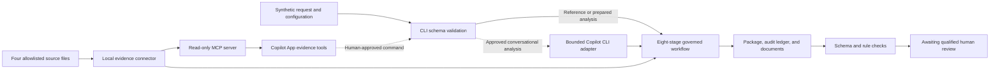
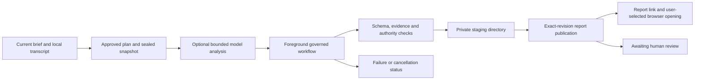

# Reference Architecture

## Intent

MOSAIC means **Multi-customer Orchestration System for Adaptive Intake and Continuous Delivery**. It is a provider-neutral, AI-first business process automation and orchestration system for solution engineering. The governing product coordinates the lifecycle from business-problem intake through approved evidence, normalized analysis, options, proposed design, delivery-readiness preparation, validation and accountable review. Documents are durable process records; they are not the entire product. This contest implementation uses GitHub for proposed changes and review evidence, with GitHub Copilot App as the planning workspace. Its local read-only MCP server, prewritten eight-stage generator and synthetic files let reviewers reproduce structural controls without a tenant or customer data.

Authentic App skill and MCP use is archived. The generator reads the local connector directly; it does not automatically import chat messages, MCP tool responses or hosted issues. Two input modes share the eight-stage contract. The offline reference uses prewritten analysis and fixed options/design. Conversational mode uses the current brief and, after approval, a bounded separately authenticated Copilot CLI analysis call. Explicit prepared-input mode can instead assemble already-authored analysis. Missing drafts or business answers never fall back to the example. The Python engine controls validation and publication; it is not itself a language model, a native App specialist fleet or a durable orchestration service.



## Logical Components

| Component                    | Responsibility                                                                                                                           | Trust boundary                                                                                                     |
| ---------------------------- | ---------------------------------------------------------------------------------------------------------------------------------------- | ------------------------------------------------------------------------------------------------------------------ |
| GitHub issue                 | Sanitized request, owners, scope, classification, acceptance criteria                                                                    | No customer records or secrets                                                                                     |
| Copilot App session          | Isolated workspace, Plan/Interactive/Autopilot controls, repository and issue context                                                    | Human approves the plan and final review                                                                           |
| Repository instructions      | Always-on workflow, safety, evidence, test, and authority constraints                                                                    | Versioned and reviewed as code                                                                                     |
| MOSAIC skill and agents      | Stage procedure and bounded specialist analysis                                                                                          | Specialists cannot approve one another                                                                             |
| Synthetic MCP server         | Lists and reads only allowlisted evidence IDs                                                                                            | Local, read-only, no network, no arbitrary paths                                                                   |
| Deterministic engine         | Executes reference or explicitly authored conversational stage inputs and creates source-of-truth JSON                                   | Repeatability does not prove analysis quality or semantic citation support                                         |
| Transcript capture           | Appends exact available turns, controls, corrections and capture-session timing before generation                                        | Local synthetic history, not verified authorship or approved evidence; excluded from the analysis-model prompt     |
| Bounded model adapter        | Sends the approved synthetic brief and evidence to the configured Copilot CLI once, validates structured analysis and retains provenance | Separate sign-in and model transport; no model tools, implicit provider switch or automatic paid retry             |
| Renderer                     | Produces nine Markdown reports, ten offline HTML pages and four JSON records, with separate report metadata                              | User text is escaped; no network assets, model execution or customer approval in the viewer                        |
| Local job worker             | Seals approved input, performs optional bounded analysis and report assembly synchronously, then publishes an exact revision             | Single synthetic customer per job store; local hashes are integrity checks, not signatures or production isolation |
| Browser handoff              | Verifies the completed revision and requests the default browser only on the user's open action                                          | A successful launch request is not evidence of viewing or approval                                                 |
| Windows notification adapter | Optional compatibility path for generic notices; disabled by foreground generation                                                       | Delivery state is separate from job success; submission is not proof of viewing or approval                        |
| Validator and CI definition  | Checks schema, citation references, option count, content patterns, and blocked authority                                                | Passing checks do not establish semantic support or authorize release                                              |
| Pull request                 | Diffs, checks, comments and corrections                                                                                                  | Review evidence; not implicit customer architecture or design approval                                             |

## Product Authority And Maturity

| Governing responsibility | Product contract                                                                                               | Challenge implementation                                                                                 |
| ------------------------ | -------------------------------------------------------------------------------------------------------------- | -------------------------------------------------------------------------------------------------------- |
| Customer workflow        | Owns request, clarification, architecture selection and exact-revision design approval                         | Fictional request reference and two explicitly unrecorded decisions; no live workflow adapter            |
| Execution ledger         | Owns execution facts, correlation, checkpoints and durable waits                                               | Stage ledger plus local job transitions and input/output hashes; no production queue or resumable worker |
| Customer policy package  | Immutable doctrine, source rules, templates, mappings and approval policy; lower layers cannot weaken baseline | Versioned synthetic policy; customer/source identity checks, required roles and document compatibility   |
| Revision control         | Owns generated dossier revisions and review history                                                            | Repository files and proposed GitHub PR process; not a competing approval inbox                          |
| Provider adapters        | Canonical ticket, grounding, revision-control and identity/secret contracts with declared capabilities         | Local read-only synthetic grounding only; no live write adapter or secret integration                    |

One installation has one immutable customer identity and may support multiple independent, long-running solution initiatives. Separate installations isolate customer content and execution. Customer identity must not be inferred from a folder name or chosen through a shared runtime selector. The local job store binds its root to one configured customer. Durable waits and idempotent resume remain governing architecture requirements, not implemented capabilities of the local worker.

There are two distinct customer decisions. First, an authorized role selects from the alternatives in the customer workflow. Only then may the selected full dossier be synthesized. Second, authorized customer roles approve that dossier's exact immutable repository revision. PR approval counts only if customer policy explicitly assigns it that authority. The challenge emits an **unselected discussion draft**, records neither decision, and stops at `awaiting_human_review`; the governing design lifecycle can end at externally authorized `Design Package Approved`. Neither state authorizes implementation or deployment.

The draft covers ten documentation areas: business outcome; requirements/acceptance; feasibility/risk; alternatives/decision; threat model/data flow; implementation/verification plan; interfaces; security/dependency requirements; deployment/rollback plan; operations/adoption/measurement. Seven planning sections link requirements, evidence and blocking questions. Coverage is not completeness: customer thresholds, product fit, executable specifications and authoritative decisions are still missing.

## Intended App Sequence

The following is a procedure to demonstrate, not a completed execution trace. Hosted issue, Plan-to-package, worktree, PR, CI, and reviewer-correction evidence remains open. The CLI does not create or manage these GitHub objects. Approval and any subsequent release are outside the active automated workflow.

```mermaid
sequenceDiagram
    actor Requester
    participant Issue as GitHub issue
    participant App as GitHub Copilot App
    participant MCP as Synthetic evidence MCP
    participant Engine as MOSAIC engine
    participant PR as Pull request
    actor Reviewer

    Requester->>Issue: Submit synthetic problem and outcomes
    Issue->>App: Start isolated Plan-mode session
    App->>Requester: Propose sources, tools, outputs, stop conditions
    Requester->>App: Approve bounded plan
    App->>MCP: List and read approved evidence IDs
    MCP-->>App: Classified, revisioned, hashed evidence
    App->>Engine: Run configured eight-stage workflow
    Engine-->>App: Package plus validation and audit records
    App->>PR: Create reviewable diff and checks
    PR->>Reviewer: Request qualified review
    Reviewer-->>PR: Review proposed changes and request corrections
    Reviewer->>Issue: Record authorized customer selection when ready
    Note over Issue,PR: Exact-revision dossier approval is a later customer decision
    Note over App,PR: Reference stops before either decision; no workflow writes
```

## Canonical Contracts

Structured JSON is authoritative for generated content and execution facts, not customer decisions. JSON Schema validates:

- synthetic request identity, required outcomes, requirements, claims, and UTC metadata
- customer configuration shape, customer/source-policy identity, option count and nonempty unique reviewer roles; roles are applied to the review package, and unsupported document requirements fail before writing
- evidence IDs, classifications, revisions, contained paths, and SHA-256 hashes
- complete workflow state, ordered stages, exactly three options, unselected proposed maturity, two unrecorded customer decisions and blocked release
- ten dossier areas and seven draft plans; runtime checks resolve their requirement, evidence and blocking-question references

Each machine-consumed stage payload carries `customerId`, `initiativeId`, `sourceTicketRef`, `workflowVersion`, `policyVersion`, `correlationId`, `controlObjective`, and a UTC timestamp.

The run ID hashes the request and generated evidence-bearing package. Changed evidence, applied reviewer roles or review-policy configuration ID change that identity. It does not bind every unused configuration field or the Git commit, and is not an approval signature. Retain the Git revision alongside it for review.

Stage metadata and the top-level `generatedAt` retain the supplied intake timestamp for deterministic workflow identity; they are not measured per-stage execution times. The renderer separately records the real UTC `package.reportMetadata.generatedAt` and `preparedBy`. Local job creation/completion timestamps describe actual job execution. Transcript `startedAt` and `endedAt` describe local capture, not original message times. The canonical-reference validator fixes only the rendering clock to the recorded reference value before comparing all bytes; it never backfills conversation dates.

An optional `submittedBy` display name appears in discovery and the overview. Missing names default to John Doe with `basis=default_placeholder` and `identityVerified=false`; supplied names remain unverified. Neither form assigns an accountable owner or reviewer, establishes consent, or records a customer decision.

## Deployment And Isolation

The proposed adoption pattern is single-customer per runtime, with isolated identities, credentials, ledgers, workspaces, repositories, and network controls. These are production design requirements, not implemented tenant isolation. A second configuration has not established portability. The current CLI is intended for an editable repository checkout, not a standalone installed wheel that bundles every fixture and schema.

The contest edition is a local reference with foreground generation and an explicit background compatibility path. It does not provide enterprise requester authentication, hosted storage or live customer connectors. The optional model adapter has its own locally configured CLI authentication; that is not customer identity verification. Windows notifications use the optional Windows-Toasts SDK wrapper and are disabled in the current intake flow.

## Local Synchronous Execution

Every interview turn is conversation-only, using an already-callable question selector or text. No filesystem, command, source lookup, delegation or analysis is required between answers and questions. The skill defers the detailed generation contract until documents are requested; the agent and run prompt reference that contract rather than repeating it.

After generation-plan approval, the agent copies available exact conversation entries into one `mosaic.jobs capture --batch ... --quiet` operation. The engine validates the entire batch before one atomic write; invalid input or a failed write before replacement preserves the previous revision rather than publishing a partial batch. Concurrent captures serialize without mixing or overwriting history. Identical retries do not rewrite content or timing; corrections remain new entries. The final generation approval closes capture. Missing history remains partial rather than reconstructed. Batch start/end times describe recording, not interview duration. Until this boundary, history exists in the current conversation, not a durable local record. The single-entry API remains compatible for explicit integrations. No automatic interception of native App messages or cross-session resume is claimed.

After the user approves the disclosed boundary, `mosaic.jobs generate --request <brief> --transcript <capture> --analyze-with-copilot` seals the request, transcript, configuration, policy, catalog and approved source bytes. It runs one configured analysis call and report assembly in the foreground, with notifications disabled, and returns the exact completed report only after validation. Without the analysis flag, a complete prepared request must already exist. Only an explicitly requested reference uses `--reference`.



Jobs live under ignored `build/intake/<initiative>/<job-id>/` by default. In-repository job stores outside `build/` are rejected. Input and engine hashes are checked before and after assembly; altered input or code requires a new run. Output is staged privately, then renamed to a revision-specific directory only after successful validation. The report manifest binds all 23 output files. The original request, transcript and approved sources are preserved. These hashes detect changes under the local trust model; a same-user attacker can alter local files and manifests. They are not tamper-proof storage or digital signatures.

The lifecycle is `queued -> running -> completed | failed | canceled`. Cancellation before execution avoids generation; cancellation during work is checked before publication. A completed job cannot be retroactively canceled or approved by the worker. OS-held locks protect capture and job execution. An interrupted process does not imply durable resume. Local disk and OS user permissions are prerequisites, not enterprise requester authentication.

The configured model, credit cap and deadline are disclosed before generation. The analysis subprocess exposes no tools, restricts its environment and CLI profile, verifies configured runtime hashes, and rejects malformed output or unexpected tool activity. Approved source acquisition remains offline/read-only; model transport is a separate authorized connection. The raw transcript stays local and outside the model prompt, while the brief preserves the supplied business answers and corrections. Fixed governance statuses are engine-owned constants; model-supplied values must match them, while omitted values are filled locally before final schema validation. A model call is not retried automatically or assumed free when it fails.

Only recognized temporary local file errors receive at most three bounded attempts. An eligible failure exposes an explicit `rebuild <job-id>` recovery path: verify retained input and evidence, create a new job, reuse validated analysis or revalidate an integrity-bound raw response after a local contract correction, and reapply every validation gate without another model call. The response digest is recorded before validation; a legacy unbound response requires an exact operator-supplied digest. Never edit retained model output or loop over rebuilds to bypass a failure. A missing, changed or still-invalid response requires a newly approved bounded model call.

### Operator Observability Boundary

`ProcessingRun` records real operation start/end/failure events and monotonic step durations. The trace includes submission validation and evidence hashes, bounded analysis, the ordered eight-stage assembly, output checks, artifact writes, retries, publication, cancellation and interruption. Preflight events are buffered until the synthetic job is valid; rejection returns the safe event trace without creating a job. The JSONL chain detects inconsistent event ordering/content, and the separate operator manifest seals the terminal HTML, JSON and trace. These local hashes are not authenticated audit storage or customer approval.

The operator report is stored beside job state, not in the immutable 23-file customer directory. Customer report revision and human-review gates are unchanged. Metrics/storage failures are explicit; incomplete operator records cannot be opened as verified terminal reports. Legacy runs are not retroactively given token counts or detailed traces.

Trace events are appended as operations occur; the HTML/JSON view refreshes at operation starts and failure/terminal checkpoints rather than rewriting the whole view for every artifact. The short analysis-validation/retention interval buffers diagnostic writes so a trace-file failure cannot discard an otherwise validated, paid analysis. A diagnostic failure blocks a successful handoff and remains visible, while retained input supports the existing no-inference rebuild.

Only allowlisted CLI/SDK usage fields are retained. `assistant.usage` is per-call; the terminal `result`/`session.shutdown` metrics are aggregates. They are not added together. Nano-AIU represents AI-credit usage; the legacy `cost` multiplier is a different unit. Cache and reasoning counters are not blindly added to input/output totals. Actual invoices, account allowances and App-side usage are outside this adapter, so whole-intake totals remain unknown. The structured JSON retains unavailable values as `null`; the human-facing HTML omits unavailable and zero-value metrics and uses one concise coverage notice instead of placeholder rows. Truncated/failed calls retain available counters with partial-coverage labels, never a free-call assumption. Recovery references the failed job and does not attribute its previous analysis charge to the new run again.

No remote telemetry exporter, account-quota connector or additional inference is enabled. The trace deliberately omits user content, model reasoning, credentials, quota payloads and raw provider diagnostics. Provider event timestamps are distinguished from local observation times; events received at CLI exit are not presented as live App observations. Approval-based intervals use recorded message timestamps only and can include App preparation, local preflight and queue time. Prepared/rebuild runs do not reuse an older intake's approval timestamp as current-run preparation latency. Inconsistent timestamp intervals are flagged, not silently converted to zero.

Failures return a terminal status with an explicit next action and whether retained input is available. A renderer or validation defect is not retried as a transient fault, and the intake agent must not turn a failed business run into a source-code repair session. Stop with a concise failure handoff; after a separate technical repair, use one integrity-checked local rebuild. Tests inject transient file failures, exhausted retries, validation failures and renderer failures, checking that partial output is discarded and model analysis is never repeated by recovery.

On **Open documents in browser**, `open <job-id>` verifies the published manifest and requests the OS default browser. Windows uses the HTTPS browser association rather than the HTML editor association. This starts no server, changes no associations and performs no generation. `browser.status=requested` does not prove that the report was viewed or approved; a launch failure does not invalidate the completed report.

The PC and generation process must remain running. There is no automatic callback, polling loop, hosted worker or PC-off execution. The user may request status or cancellation for the actual job. Completion always leaves both customer decisions unrecorded and release blocked.

### Background Compatibility

The older `submit` command can explicitly start a detached worker. Optional Windows-Toasts delivery retains its per-user `MOSAIC.LocalReports` identity and generic notices; transport status is separate from report validity or human acknowledgment. `notify <job-id> --retry` retries only an eligible delivery attempt, not inference or report generation. This path is neither the default intake handoff nor evidence of durable unattended operation. No system-wide registration, notification-policy change or customer approval is performed.

## Durable Private Runner Design

This is the requested extension design, not a deployed service. Use one private installation per customer with a durable queue, versioned state store, immutable artifact storage, containerized worker pool, notification outbox and authenticated workflow adapter. Keep public contest code/media separate from all operational intake, evidence, job records and reports. Select hosting, residency, retention, network controls and cost limits with the customer's authorized owners; no specific cloud service, capability or live connector is asserted here.

| Concern              | Proposed control and acceptance evidence                                                                                                                                                                                      |
| -------------------- | ----------------------------------------------------------------------------------------------------------------------------------------------------------------------------------------------------------------------------- |
| Submission           | Authenticate the requester, bind installation/customer identity server-side, validate the approved plan and source boundary, persist an input revision before queue acknowledgment                                            |
| Long-running work    | Lease a job with bounded timeouts and heartbeats; use idempotency keys for retries and a dead-letter path after bounded failures; test worker loss and duplicate queue delivery                                               |
| Model analysis       | Separately authorize a headless model adapter, credentials, budget, tool allowlist and data processing terms; persist versioned stage inputs/outputs and reject malformed or unsupported analysis                             |
| Artifact publication | Write to private immutable storage, validate schema/evidence/authority, atomically record the completed revision, and deny access until that commit exists                                                                    |
| Cancellation         | Record cancellation durably, check it between stages and before publication, and test cancellation/publication races without deleting a completed review revision                                                             |
| Notification         | Use a transactional outbox bound to job and artifact revision; send an authenticated review link, avoid business details in payloads, and separate transport acknowledgment from human acknowledgment                         |
| Customer decisions   | Require an authenticated, policy-authorized architecture-selection event before selected-dossier work; require later approval of the exact dossier revision; validate signatures, expiry, replay IDs and referenced revisions |
| Isolation            | Separate identities, storage, queues, keys, repositories and network policy per customer; never accept customer identity or permissions merely from a caller-supplied field                                                   |
| Operations           | Apply customer-approved retention, backup/recovery, audit access, dependency/license controls and service ownership; test recovery from committed revisions before any durability claim                                       |

Deployment path, requiring separate authorization:

1. Agree the customer's residency, identity, source, retention, cost and approval policy, plus supported adapter capabilities and acceptance evidence.
2. Provision the isolated private queue, state/artifact stores and runtime through the customer's authorized infrastructure process. Do not store customer data in this public-intended demo repository.
3. Deploy version-pinned workers with least privilege and approved network paths. Introduce model or workflow credentials only through the customer's approved secret mechanism.
4. Exercise synthetic submission, worker termination, retry, duplicate messages, cancellation races, unauthorized callbacks, stale revisions, notification failure and recovery.
5. Obtain qualified review of the actual results and run a limited authorized rollout with a rollback procedure. A design document or a passing local report test is not deployment evidence.

This architecture can move both analysis and assembly off the user's PC only after those runtime and adapter capabilities are implemented and verified. It does not authorize implementation of the customer solution being designed.

## Failure Behavior

| Condition                                                                       | Required behavior                                                         |
| ------------------------------------------------------------------------------- | ------------------------------------------------------------------------- |
| Missing request field                                                           | Fail schema validation before acquisition                                 |
| Non-`SYN-` identifier                                                           | Reject the request                                                        |
| Unallowlisted source or classification                                          | Stop acquisition and report the source ID                                 |
| Absolute, traversal, or out-of-root resolved source path; duplicate evidence ID | Reject the catalog entry                                                  |
| Missing or unknown required citation                                            | Fail structural material-claim validation; humans assess semantic support |
| Unknown requirement or blocking-question reference in a readiness plan          | Fail traceability validation                                              |
| Unsupported customer-required document                                          | Fail before writing a partial package                                     |
| Fabricated customer decision or implicit PR authority                           | Fail schema and runtime authority checks                                  |
| Fewer or more than three options                                                | Fail the package                                                          |
| Unknown production decision                                                     | Preserve as a blocking unknown                                            |
| All automated checks pass                                                       | Remain `awaiting_human_review`                                            |

## GitHub-Native Differentiation

MOSAIC's reusable contracts are provider-neutral; its intended review workflow fits GitHub-centered teams. GitHub documents issue, session, worktree, customization, and PR surfaces in its own app. Claude also supports skills, MCP, worktrees, and GitHub integration. The argument is first-party workflow fit, not exclusivity or measured superiority. See the official sources and proof boundaries in the [competition audit](../submission/competition-audit.md#research-authority).
