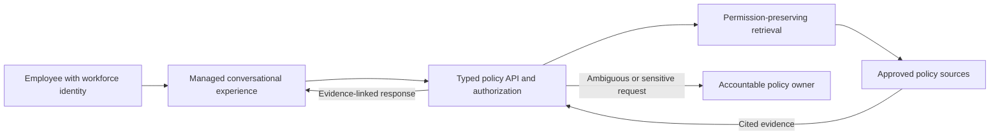

# Employee Policy Guidance: Proposed Architecture Brief

## Use Case Context

**Use case:** Employee Policy Guidance

**Business problem:** Employees cannot reliably find current policy answers across distributed content, creating repeated service inquiries, inconsistent guidance, and slow escalation to accountable policy owners.

**Assessment scope:** Scope requires confirmation with the customer.

**Affected users:** Employees seeking policy guidance; Service desk analysts handling repeated inquiries; Policy owners accountable for authoritative interpretation

> Maturity: `proposed` | Implementation: `not_started`

Prewritten discussion draft for the fictional policy assistant, not a customer-selected design. The full dossier requires authorized architecture selection first. Product fit and production controls remain unvalidated.

This is the proposed employee-assistant design, not an implemented service. MOSAIC prepares
and validates this document; its own workflow is described in the repository architecture guide.

## Proposed Components

| Concern | Proposed design |
| --- | --- |
| experience | Managed employee policy assistant surface |
| identity | Workforce identity with user-context propagation |
| policyBoundary | Typed policy API and approved-source manifest |
| knowledgeBoundary | Read-only retrieval over approved, access-trimmed content |
| audit | Versioned evidence and access records with human-owned retention and review |

## Trust Boundaries

- Employee identity to managed conversational experience
- Conversational experience to authorized policy API
- Policy API to permission-preserving retrieval over approved sources
- Ambiguous or sensitive requests to an accountable policy owner

## Required Decisions

- Confirm production data owner
- Approve identity and authorization model
- Approve retention period, model, and deployment region
- Confirm measurable acceptance criteria

## Ten-Part Dossier Coverage

These are draft coverage areas across the existing reference files, not ten completed or
approved documents. The final dossier requires customer architecture selection first.
Each plan below is a recommendation derived from the cited synthetic requirements and
evidence, not a source fact or a tested implementation. Missing customer evidence remains explicit.

| ID | Documentation area | Draft location |
| --- | --- | --- |
| DOS-001 | Business problem and outcomes | [intake-report.md](intake-report.md) |
| DOS-002 | Requirements and acceptance | [intake-report.md](intake-report.md) |
| DOS-003 | Feasibility and risk | [architecture-brief.md](architecture-brief.md) |
| DOS-004 | Alternatives and decision | [option-matrix.md](option-matrix.md) |
| DOS-005 | Threat model and data flow | [architecture-brief.md](architecture-brief.md) |
| DOS-006 | Implementation and verification plan | [architecture-brief.md](architecture-brief.md) |
| DOS-007 | API and integration specifications | [architecture-brief.md](architecture-brief.md) |
| DOS-008 | Security and dependency requirements | [architecture-brief.md](architecture-brief.md) |
| DOS-009 | Deployment and rollback plan | [architecture-brief.md](architecture-brief.md) |
| DOS-010 | Operations, adoption and measurement | [architecture-brief.md](architecture-brief.md) |

## Feasibility And Delivery Risk

**PLAN-001 | recommendation | discussion draft**

Before selecting an option, test whether approved sources can provide current policy answers without losing user permissions. Compare connector coverage, content ownership, escalation capacity, operating cost and delivery dependencies using the same three-option criteria.

**Evidence still required:** Customer-owned source inventory, supported integration evidence, named operating roles, cost inputs and delivery constraints. No feasibility rating, budget or completion date has been validated.

Requirements: REQ-001, REQ-003 | Evidence basis: EVD-001, EVD-004 | Blocking questions: UNK-001, UNK-002, UNK-004

## Threat Model And Data Flow

**PLAN-002 | recommendation | discussion draft**

Trace employee identity through the conversational surface, policy API and source retrieval. Assess forged identity, source prompt injection, stale evidence and sensitive-response leakage. Treat retrieved text as data, preserve source authorization, and escalate ambiguity to a policy owner instead of inventing an authoritative answer.

**Evidence still required:** Security-reviewed identity and permission propagation, prohibited-data tests, freshness ownership and approved retention. This is a threat analysis starting point, not a completed security assessment.

Requirements: REQ-001, REQ-002, REQ-003 | Evidence basis: EVD-001, EVD-002, EVD-003 | Blocking questions: UNK-002, UNK-003

## Proposed Implementation And Verification

**PLAN-003 | recommendation | discussion draft**

After customer selection and a separate implementation authorization, validate one synthetic source-to-answer path before broadening coverage. Plan checks for permitted and denied access, missing or stale citations, unsupported answers, ambiguity and human escalation. Tie each acceptance check to its requirement and retain failures and corrections.

**Evidence still required:** Customer-approved acceptance thresholds, representative cases and independent review. No employee-assistant code is generated here; the proposed solution tests have not been executed.

Requirements: REQ-001, REQ-002, REQ-003, REQ-004 | Evidence basis: EVD-001, EVD-002, EVD-003, EVD-004 | Blocking questions: UNK-002, UNK-004

## Proposed Interfaces And Integrations

**PLAN-004 | recommendation | discussion draft**

Define requests with verified user context, a question and correlation ID; responses with answer status, source IDs and revisions, or a human-escalation reference. Source adapters must enforce access before returning content. An API caller cannot assert its own permission scope.

**Evidence still required:** Authorized integration owners, source API contracts, identity mappings and access tests. Endpoint selection and executable API specifications remain pending customer architecture selection.

Requirements: REQ-001, REQ-002, REQ-004 | Evidence basis: EVD-001, EVD-003, EVD-004 | Blocking questions: UNK-001, UNK-002

## Security Controls And Dependency Requirements

**PLAN-005 | recommendation | discussion draft**

Specify least-privileged identities, approved-source boundaries, evidence integrity, protected review records and customer-owned retention. For later implementation, plan a dependency inventory, license review and software-bill-of-materials evidence before release.

**Evidence still required:** Selected-platform controls, customer-approved risk disposition and actual dependency provenance. This draft is not an SBOM, certification or proof of implemented production controls.

Requirements: REQ-002, REQ-003, REQ-004 | Evidence basis: EVD-002, EVD-003, EVD-004 | Blocking questions: UNK-002, UNK-003, UNK-004

## Proposed Deployment And Rollback

**PLAN-006 | recommendation | discussion draft**

Document separate non-production and production change decisions. Before future rollout, require the configuration revision, access and answer-quality acceptance, limited exposure, rollback triggers and a change owner. A failed control should stop rollout and restore an approved prior configuration where supported.

**Evidence still required:** Selected-platform promotion and rollback capabilities, approved regions, recovery objectives and a tested recovery procedure. No pipeline, environment, deployment or rollback is executed here.

Requirements: REQ-002, REQ-003, REQ-004 | Evidence basis: EVD-002, EVD-003, EVD-004 | Blocking questions: UNK-002, UNK-004

## Proposed Operations, Adoption And Measurement

**PLAN-007 | recommendation | discussion draft**

Assign content freshness, service support and policy escalation in the customer's workflow. Plan onboarding, support training and review of failures. Compare answer coverage, unresolved inquiries, review effort, rework and total cost against customer-provided baselines without logging sensitive content.

**Evidence still required:** Named customer owners, inquiry baseline, success thresholds, adoption plan and approved telemetry/retention. No service handover, operational monitoring or measured outcome is claimed.

Requirements: REQ-001, REQ-003, REQ-004 | Evidence basis: EVD-001, EVD-002, EVD-004 | Blocking questions: UNK-001, UNK-003, UNK-004

## Requirement To Plan Trace

| Requirement | Proposed plan coverage | Review question |
| --- | --- | --- |
| REQ-001 | PLAN-001: Feasibility And Delivery Risk; PLAN-002: Threat Model And Data Flow; PLAN-003: Proposed Implementation And Verification; PLAN-004: Proposed Interfaces And Integrations; PLAN-007: Proposed Operations, Adoption And Measurement | Does the proposed coverage define sufficient design, evidence and verification work? |
| REQ-002 | PLAN-002: Threat Model And Data Flow; PLAN-003: Proposed Implementation And Verification; PLAN-004: Proposed Interfaces And Integrations; PLAN-005: Security Controls And Dependency Requirements; PLAN-006: Proposed Deployment And Rollback | Does the proposed coverage define sufficient design, evidence and verification work? |
| REQ-003 | PLAN-001: Feasibility And Delivery Risk; PLAN-002: Threat Model And Data Flow; PLAN-003: Proposed Implementation And Verification; PLAN-005: Security Controls And Dependency Requirements; PLAN-006: Proposed Deployment And Rollback; PLAN-007: Proposed Operations, Adoption And Measurement | Does the proposed coverage define sufficient design, evidence and verification work? |
| REQ-004 | PLAN-003: Proposed Implementation And Verification; PLAN-004: Proposed Interfaces And Integrations; PLAN-005: Security Controls And Dependency Requirements; PLAN-006: Proposed Deployment And Rollback; PLAN-007: Proposed Operations, Adoption And Measurement | Does the proposed coverage define sufficient design, evidence and verification work? |

## Design Review Worklist

- Review responsibilities and trust boundaries with the customer system, data and security owners.
- For each plan, confirm the linked requirement, proposed approach, required evidence and blocking questions.
- Define how interfaces, authorization, failure handling and acceptance behavior will be verified after separate implementation authorization.
- Challenge dependency assumptions, operating ownership, rollback, adoption and measurement before treating the package as delivery-ready.
- After architecture selection, complete the selected dossier and obtain approval of its exact revision. This draft does not authorize building or deployment.
